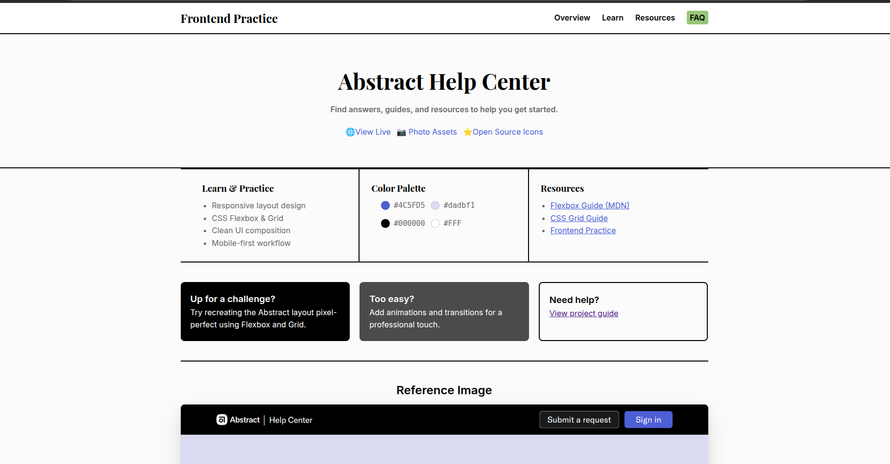
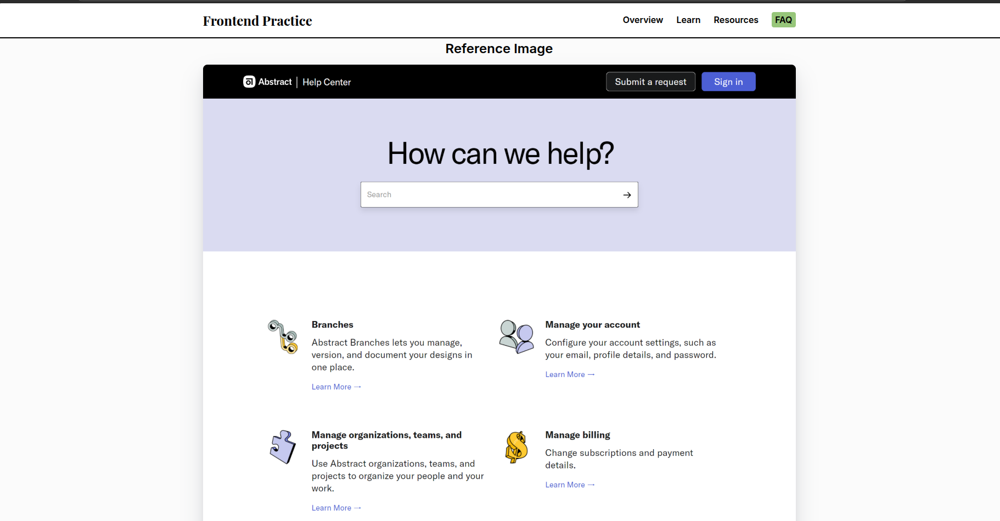
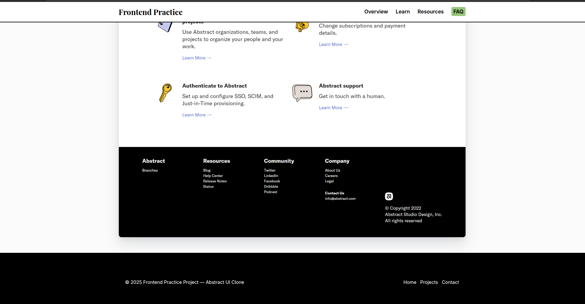
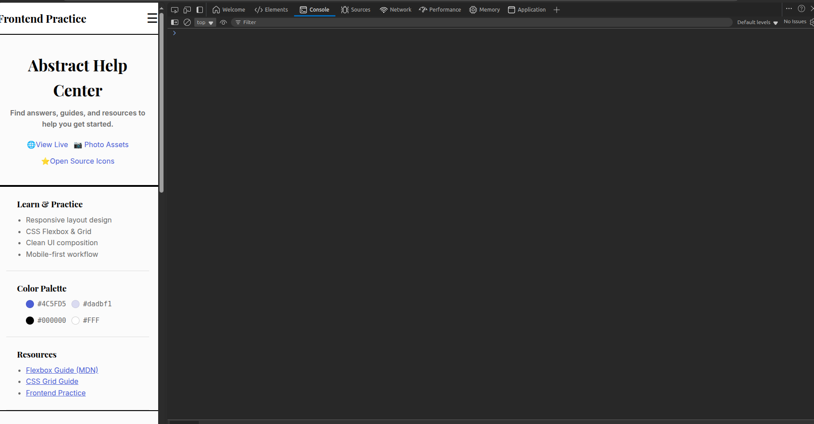

<div align="center">
	<h1>🟣 Abstract Help Center — UI Clone</h1>
	<p><em>Beautiful, responsive, and accessible UI clone of the Abstract Help Center landing page.</em></p>
  
	<a href="https://habtedev.github.io/abstract/" target="_blank" rel="noopener noreferrer">
		
	</a>
  
	<br>
	
</div>

---

## 🌟 Overview

This project is a pixel-perfect, mobile-first UI clone of the Abstract Help Center landing page, built with semantic HTML and modern CSS. It’s fully responsive, accessible, and deploys instantly on GitHub Pages.

> **Live Demo:** [🌐 https://habtedev.github.io/abstract/](https://habtedev.github.io/abstract/)


## 📋 Project Highlights

- **Mobile-first responsive design**
- **Accessibility** (WCAG guidelines)
- **Semantic HTML structure**
- **Clean, maintainable CSS**
- **Cross-browser compatibility**


## 🛠 Tech Stack

- **HTML5** (semantic markup)
- **CSS3** (Flexbox, Grid, custom properties)
- **Responsive Design** (mobile-first approach)
- **No frameworks or build tools**


## 📁 Project Structure

```
abstract/
├── index.html         # Main entry point
├── css/
│   └── styles.css     # Mobile-first stylesheet
├── images/            # Assets directory
│   ├── screenhot1.png # Mobile view
│   ├── screenhot2.png # Tablet view
│   ├── screenhot3.png # Desktop view
│   └── screenhot4.png # Large screen view
├── README.md          # Project documentation
└── REFLECTION.md      # Development insights
```

## 🎯 Features

- ✅ Fully responsive design (mobile, tablet, desktop)
- ✅ Accessible navigation and interactions
- ✅ Semantic HTML structure
- ✅ Clean, component-based CSS architecture
- ✅ Cross-browser compatible
- ✅ No JavaScript dependencies

## 🚀 Quick Start

### Prerequisites

- A modern web browser
- Local development server (optional)

### Local Development

 **Clone the repository**

```bash
git clone https://github.com/habtedev/abstract.git
cd abstract
````


 

## 📸 Screenshots

Below are the included screenshots for quick reference.

|        Desktop View                                                   | Desktop View                                                         |
| --------------------------------------------------------------------- | --------------------------------------------------------------------- |
|  |  |

| Desktop View                                                           | mobile Screen                                                                |
| ---------------------------------------------------------------------- | --------------------------------------------------------------------------- |
|  |  |

## 🎨 Design Implementation

### Breakpoints

- Mobile: < 768px (default)
- Tablet: 768px - 1024px
- Desktop: 1024px - 1440px
- Large Screens: > 1440px

### CSS Methodology

- Mobile-first responsive design
- CSS custom properties for theming
- BEM-like naming convention for components
- Utility classes for common patterns

## 📝 Development Workflow

### Updating Screenshots

```bash
# Replace existing screenshot
cp /path/to/new/image.png images/screenhot1.png

# Optimize PNG files (optional)
pngquant --quality=70-90 --force --output images/screenhot1.png images/screenhot1.png
```

### Git Commands

```bash
# Stage changes
git add .

# Commit with descriptive message
git commit -m "feat: improve responsive navigation"

# Push to remote
git push origin main
```

## 🌐 Deployment

### GitHub Pages (Current)

- Automatically deployed from the `main` branch (no build process required).
- Served from the repository root (index.html).

### Alternative Deployment Options

- Netlify: Drag & drop the `abstract` folder or connect the repo
- Vercel: Connect the GitHub repository
- Any static hosting service

## ✅ Project Checklist

- [x] Responsive design implemented
- [x] Accessibility features included
- [x] Cross-browser testing completed
- [x] Code pushed to GitHub repository
- [x] Live demo deployed via GitHub Pages
- [x] Screenshots included for all breakpoints
- [ ] Reflection document completed (REFLECTION.md)

## 🔧 Browser Support

- Chrome (latest)
- Firefox (latest)
- Safari (latest)
- Edge (latest)

## 🤝 Contributing

This is a personal learning project. For suggestions or issues, please open a GitHub issue.

## 📄 License

This project is for educational purposes. All Abstract brand assets are property of their respective owners.

## 📞 Contact

- GitHub: @habtedev
- Project Link: https://github.com/habtedev/abstract

> Note: This is a UI clone for educational purposes. Abstract is a trademark of its respective owners.
